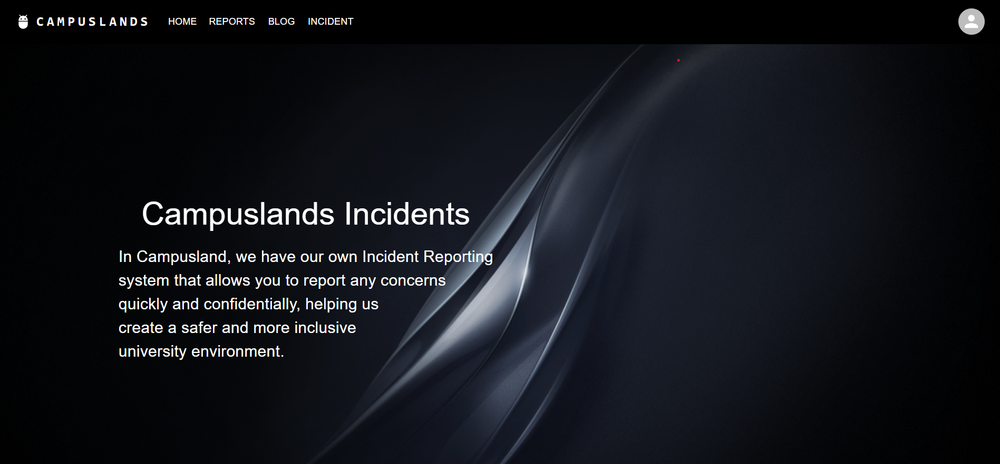
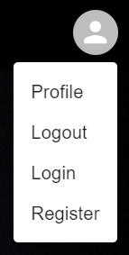
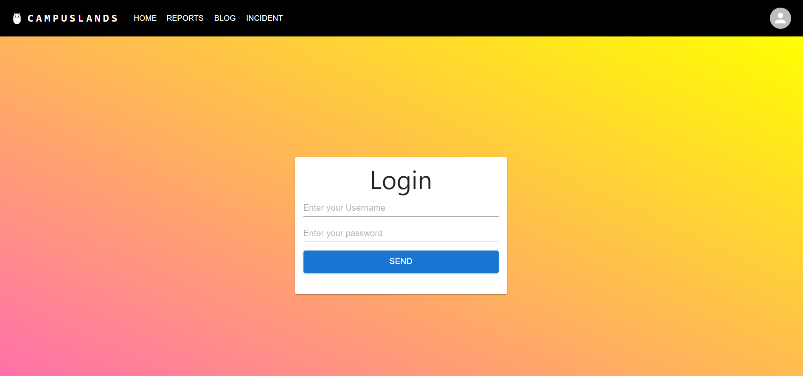
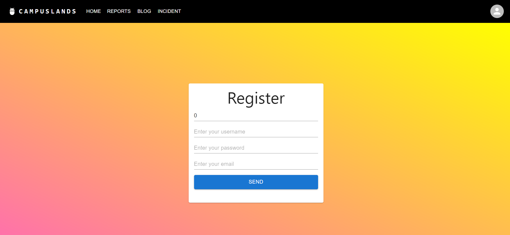
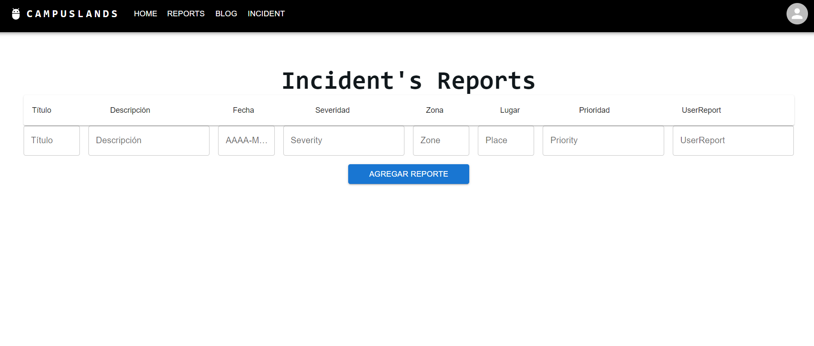
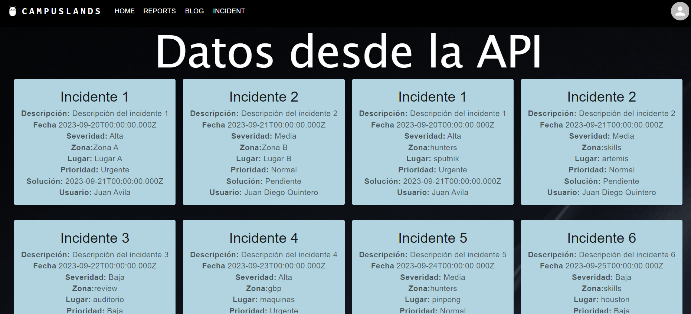

# CampusLands Incident Reporting

El proyecto **CampusLands Incident Reporting** es una plataforma que permite a los usuarios reportar incidentes y daños en diferentes áreas de CampusLands, como Hunters, SkillReview, SkillSoftware, administración y más. Los usuarios pueden registrarse en la plataforma para crear, ver y gestionar sus reportes de incidentes en varios lugares dentro de CampusLands, como Sputnik, Apolo, Artemis, Zona Pizzeta, Cubículos, Auditorio, Mesas, GBP, entre otros.

## Funcionalidades principales

- **Registro de usuarios:** Los usuarios pueden registrarse en la plataforma proporcionando información básica, como nombre, correo electrónico y contraseña.

- **Reporte de incidentes:** Los usuarios registrados pueden crear reportes detallados de incidentes, especificando la ubicación exacta y describiendo el problema.

- **Visualización de reportes:** Los usuarios pueden ver los reportes de incidentes existentes en diversas áreas de CampusLands.

- **Gestión de reportes:** Los usuarios pueden editar y eliminar sus propios reportes.

## Tecnologías utilizadas

- **Frontend:** HTML, CSS, JavaScript (posiblemente un framework como React o Vue.js).

- **Backend:** Node.js, Express.js.

- **Base de datos:** MongoDB.

- **Autenticación de usuarios:** JWT (JSON Web Tokens) para la autenticación de usuarios.

## Instalación y configuración

Para ejecutar este proyecto en tu máquina local, sigue estos pasos:

1. Clona el repositorio desde GitHub:

```bash
git clone https://github.com/JuanDiegoQuinteroCampus/IncidentsProjectCampus.git
```


1. Entra al directorio del proyecto:

```
cd campuslands-incident-reporting
```

1. Instala las dependencias del frontend y del backend:

```
npm install
cd ../backend
npm install
```

1. Configura la base de datos MongoDB en el archivo de configuración `backend/config/db.js`.
2. Ejecuta el servidor backend:

```
npm start
```

1. Ejecuta la aplicación frontend:

```
npm start
```

1. Abre tu navegador y accede a `http://localhost:3000` para usar la aplicación.

## Uso

- Regístrate en la plataforma con tu correo electrónico y contraseña.
- Crea un nuevo reporte de incidente especificando la ubicación y describiendo el problema.
- Explora los reportes de incidentes existentes en diferentes áreas de CampusLands.
- Edita o elimina tus propios reportes si es necesario.


# Visualización o interacción con el usuario

Como entrada a la pagina web de incidencias se podrá notar el inciio o home de la pagina, la cual es la pagina principal



Luego de esto nos podremos loguear dandole click al icono del usuario seleccionando la opcion login



Esto nos dara la ruta  "http://192.168.129.72:5166/login" el cual nos podremos loguear con los datos que ya tenemos, ponemos el username y la password luego de esto le damos send



Si en dado caso no te has registrado, en el menu del icono de usuario dale click a register para poder registrarse, llena los campos primeor con la cedula, username, password, email. Despues de sto te redirige al login par apoder ingresar




Luego de esto podras dirigirte al apartado de reports, en dond epodras realizar tus reportes sobre cualquier incidente que se alla presentado en campuslands (enfocado a los materiales). Deberas llenar los campos del reporte con:
- Titulo
- Descripcion
- Fecha (Formato, AAAA-MM-DD)
- Severidad
- Zona
- Lugar
- Prioridad
- UserRepor (Este campo no ser anecesario llenarlo ya que toma el username introdujo al momento de registrarse) 

### Importante, Recordar que para ingresar reportes debes estar loggeado de lo contrario no te dejará ingresarlos




Para poder visualizar los datos o los incidentes ya reportados tendras que dirigirte al apartado Incidents, en el cual solo te dejará ver los datos si ya estas loggeado, de lo constrario se quedara cargando infinitamente, si ya estas loggeado podras visualizar los datos de este modo




# Pruebas backend
